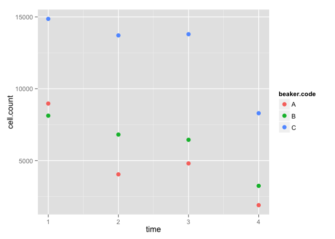

# Jan28-trials


```r
library(googlesheets)
suppressPackageStartupMessages(library("dplyr"))
library(ggplot2)

data <- read.csv("/Users/Joey/Documents/mussel-TPC/mussel-TPC/01-28-16-cell-counts-trial.csv")

data %>% 
	filter(beaker.code == "E") %>% 
	ggplot(., aes(x = time, y = cell.count)) + geom_point()
```

 

```r
data %>% 
	filter(date == "2/2/2016") %>% 
	group_by(beaker.code) %>% 
	ggplot(., aes(x = time, y = cell.count, color = beaker.code)) + geom_point(size = 3)
```

 

